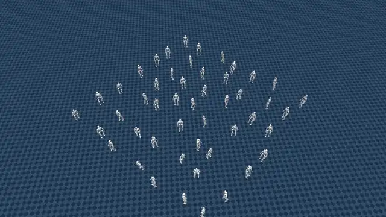
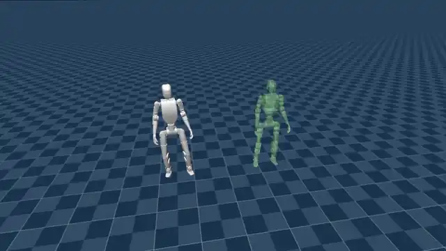

# cyclo_mjlab

[](https://mujoco.readthedocs.io/en/3.5.0/)
[](https://github.com/mujocolab/mjlab)
[](https://docs.python.org/3/whatsnew/3.11.html)
[](https://releases.ubuntu.com/22.04/)
[](https://opensource.org/license/apache-2-0)

## Overview

`cyclo_mjlab` is a research-oriented repository built on
[MJLab](https://github.com/mujocolab/mjlab) and
[MuJoCo](https://mujoco.org/). It provides reinforcement learning environments,
task configurations, and motion-processing tools for developing locomotion and
motion-imitation policies for the ROBOTIS K1 humanoid robot.

The repository currently provides:

- **Velocity**: flat-ground velocity-tracking locomotion
- **Mimic**: Dance1 and Dance2 reference-motion tracking
- Automatic generation of `params/sim2real.yaml` when training starts
- Automatic export of `exported/policy.onnx` and `exported/policy.pt` during play

> [!IMPORTANT]
> This repository currently uses MJLab 1.2.0, MuJoCo 3.5.0, and Python 3.11.

### Locomotion



### Motion imitation



## Installation (Docker)

Docker provides a consistent environment with the required Python packages,
MuJoCo libraries, and GPU configuration pre-installed. Conda and a host Python
environment are not required.

### Prerequisites

- Docker Engine with Docker Compose
- NVIDIA GPU with an appropriate NVIDIA driver
- NVIDIA Container Toolkit
- Git and access to this repository

### Steps

1. Clone the repository with its submodules:

   ```bash
   git clone --recurse-submodules git@github.com:ROBOTIS-GIT/cyclo_mjlab.git
   cd cyclo_mjlab
   ```

   If the repository was cloned without submodules, initialize them separately:

   ```bash
   git submodule update --init --recursive
   ```

2. Build the Docker image when needed and start the container:

   ```bash
   ./docker/container.sh start
   ```

3. Enter the running container:

   ```bash
   ./docker/container.sh enter
   ```

After entering the container, the training and playback commands below can be
run directly from `/workspace/cyclo_mjlab`.

### Docker commands

| Command | Description |
| --- | --- |
| `./docker/container.sh start` | Build the image if needed, initialize submodules, and start the container |
| `./docker/container.sh enter` | Open an interactive shell in the running container |
| `./docker/container.sh stop` | Stop the container |
| `./docker/container.sh logs` | Follow the container logs |
| `./docker/container.sh clean` | Remove the container and image while preserving cache volumes |

The Docker image includes:

- Python 3.11
- MJLab 1.2.0
- MuJoCo and MuJoCo Warp 3.5.0
- Warp 1.12.0
- All dependencies declared in `pyproject.toml`

The project source and `logs/` directory are shared with the host, so training
results remain available after the container is removed.

## Try Examples

### Velocity

#### Train

```bash
python scripts/reinforcement_learning/train.py Cyclo-Velocity-Flat-K1-Rev1-v0 \
  --env.scene.num-envs 4096
```

#### Play

```bash
python scripts/reinforcement_learning/play.py Cyclo-Velocity-Flat-K1-Rev1-v0 \
  --checkpoint-file logs/rsl_rl/k1_velocity/<run>/model_<iteration>.pt \
  --num-envs 1
```

### Mimic

#### Train Dance1

```bash
python scripts/reinforcement_learning/train.py Cyclo-Mimic-K1-Rev1-Dance1 \
  --env.scene.num-envs 4096
```

#### Train Dance2

```bash
python scripts/reinforcement_learning/train.py Cyclo-Mimic-K1-Rev1-Dance2 \
  --env.scene.num-envs 4096
```

#### Play Dance1

```bash
python scripts/reinforcement_learning/play.py Cyclo-Mimic-K1-Rev1-Dance1 \
  --checkpoint-file logs/rsl_rl/k1_mimic/<run>/model_<iteration>.pt \
  --num-envs 1
```

To display the reference trajectory next to the trained policy during playback:

```bash
python scripts/reinforcement_learning/play.py Cyclo-Mimic-K1-Rev1-Dance1 \
  --checkpoint-file logs/rsl_rl/k1_mimic/<run>/model_<iteration>.pt \
  --num-envs 1 \
  --reference-ghost-offset 1.4,0,0
```

#### Play Dance2

```bash
python scripts/reinforcement_learning/play.py Cyclo-Mimic-K1-Rev1-Dance2 \
  --checkpoint-file logs/rsl_rl/k1_mimic/<run>/model_<iteration>.pt \
  --num-envs 1
```

Replace `<run>` and `<iteration>` with the timestamped run directory and model
iteration to use.

## Motion Utilities

The motion tools convert K1 CSV motion data into the MuJoCo-ordered NPZ format
and validate or replay the converted trajectory:

```bash
python scripts/tools/motion/csv_to_npz.py --help
python scripts/tools/motion/replay_npz.py --help
```

## License

This repository is licensed under the
[Apache License 2.0](LICENSE).

### Third-party components

- **MJLab**: Apache License 2.0; see
  [THIRD_PARTY_LICENSES.md](THIRD_PARTY_LICENSES.md)
- **HybridRobotics/whole_body_tracking**: MIT License; see
  [THIRD_PARTY_LICENSES.md](THIRD_PARTY_LICENSES.md)
- **ROBOTIS AI Sapiens K1 Rev.1 assets**: Apache License 2.0; see
  [LICENSE.ai_sapiens](source/assets/robots/robotis_k1/LICENSE.ai_sapiens)
