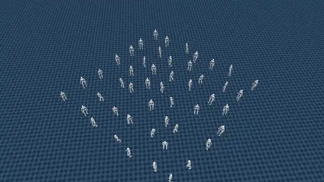
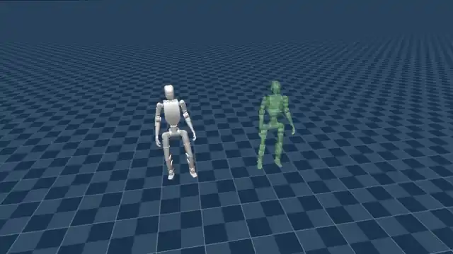

# cyclo_mjlab

[](https://mujoco.readthedocs.io/en/3.5.0/)
[](https://github.com/mujocolab/mjlab)
[](https://docs.python.org/3/whatsnew/3.11.html)
[](https://releases.ubuntu.com/22.04/)
[](https://opensource.org/license/apache-2-0)

## Overview

`cyclo_mjlab` is a research-oriented repository built on
[MJLab](https://github.com/mujocolab/mjlab) and
[MuJoCo](https://mujoco.org/). It provides reinforcement learning environments,
task configurations, and motion-processing tools for developing locomotion and
motion-imitation policies for the ROBOTIS K1 humanoid robot.

The repository currently provides:

- **Velocity**: flat-ground velocity-tracking locomotion
- **Mimic**: Dance1 and Dance2 reference-motion tracking
- Automatic generation of `params/sim2real.yaml` when training starts
- Automatic export of `exported/policy.onnx` and `exported/policy.pt` during play

> [!IMPORTANT]
> This repository currently uses MJLab 1.2.0, MuJoCo 3.5.0, and Python 3.11.

### Locomotion



### Motion imitation



## Installation (Docker)

Docker provides a consistent environment with the required Python packages,
MuJoCo libraries, and GPU configuration pre-installed. Conda and a host Python
environment are not required.

### Prerequisites

- Docker Engine with Docker Compose
- NVIDIA GPU with an appropriate NVIDIA driver
- NVIDIA Container Toolkit
- Git and access to this repository

### Steps

1. Clone the repository with its submodules:

   ```bash
   git clone --recurse-submodules git@github.com:ROBOTIS-GIT/cyclo_mjlab.git
   cd cyclo_mjlab
   ```

   If the repository was cloned without submodules, initialize them separately:

   ```bash
   git submodule update --init --recursive
   ```

2. Build the Docker image when needed and start the container:

   ```bash
   ./docker/container.sh start
   ```

3. Enter the running container:

   ```bash
   ./docker/container.sh enter
   ```

After entering the container, the training and playback commands below can be
run directly from `/workspace/cyclo_mjlab`.

### Docker commands

| Command | Description |
| --- | --- |
| `./docker/container.sh start` | Build the image if needed, initialize submodules, and start the container |
| `./docker/container.sh enter` | Open an interactive shell in the running container |
| `./docker/container.sh stop` | Stop the container |
| `./docker/container.sh logs` | Follow the container logs |
| `./docker/container.sh clean` | Remove the container and image while preserving cache volumes |

The Docker image includes:

- Python 3.11
- MJLab 1.2.0
- MuJoCo and MuJoCo Warp 3.5.0
- Warp 1.12.0
- All dependencies declared in `pyproject.toml`

The project source and `logs/` directory are shared with the host, so training
results remain available after the container is removed.

## Try Examples

### Velocity

#### Train

```bash
python scripts/reinforcement_learning/train.py Cyclo-Velocity-Flat-K1-Rev1-v0 \
  --env.scene.num-envs 4096
```

#### Play

```bash
python scripts/reinforcement_learning/play.py Cyclo-Velocity-Flat-K1-Rev1-v0 \
  --checkpoint-file logs/rsl_rl/k1_velocity/<run>/model_<iteration>.pt \
  --num-envs 1
```

### Mimic

#### Train Dance1

```bash
python scripts/reinforcement_learning/train.py Cyclo-Mimic-K1-Rev1-Dance1 \
  --env.scene.num-envs 4096
```

#### Train Dance2

```bash
python scripts/reinforcement_learning/train.py Cyclo-Mimic-K1-Rev1-Dance2 \
  --env.scene.num-envs 4096
```

#### Train and play Koryo

The Koryo task uses `k1_koryo_converted.npz`: 4,293 frames at 50 Hz
(about 85.84 seconds), converted from the headered 60 Hz source CSV.
It uses the standard K1 Mimic rewards and PPO configuration. Training samples
across the full reference with 30-second episodes; playback starts at frame zero.

```bash
python scripts/reinforcement_learning/train.py Cyclo-Mimic-K1-Rev1-Koryo \
  --env.scene.num-envs 1024 \
  --agent.run-name koryo
```

For a short integration check, append `--agent.max-iterations 2` and use
`--env.scene.num-envs 32`. This verifies PPO updates, not motion mastery.

```bash
python scripts/reinforcement_learning/play.py Cyclo-Mimic-K1-Rev1-Koryo \
  --checkpoint-file logs/rsl_rl/k1_mimic/<run>/model_<iteration>.pt \
  --num-envs 1 \
  --reference-ghost-offset 1.4,0,0
```

To regenerate the motion files while preserving the original CSV:

```bash
python scripts/tools/motion/umr_csv_to_npz.py \
  -f source/assets/motions/K1_rev1/koryo/k1_koryo.csv \
  --output_fps 50
```

#### Koryo perturbation curriculum

`Cyclo-Mimic-K1-Rev1-Koryo-Curriculum` retains Koryo's rewards, 25 cm
body-height termination and 30-second episode cap. Reset/observation noise,
encoder bias and COM offsets start at 25% amplitude and progress through
50%, 75%, and 100%. Friction expands from `[0.6375, 0.8625]` to the original
`[0.3, 1.2]`; push velocity scales are 0%, 25%, 50%, and 100%.
Physics randomization is sampled on episode resets so new stages take effect.

Ten percent of environments start at frame zero. Each stage requires at least
1,024 completed attempts from this group and an 80% 30-second survival rate
before advancing. Failures at the time limit count as failures; interrupted
attempts and attempts begun at an older stage are excluded. This gate measures
the first 30 seconds, not completion of the full 85.84-second motion.
The remaining environments mix adaptive starts with 25% uniform sampling.

Resume an existing Koryo run with the curriculum (stop the old training process
first if replacing it):

```bash
python scripts/reinforcement_learning/train.py Cyclo-Mimic-K1-Rev1-Koryo-Curriculum \
  --env.scene.num-envs 2048 \
  --agent.run-name koryo_curriculum \
  --agent.resume True \
  --agent.load-run 2026-10-08_12-01-23_koryo \
  --agent.load-checkpoint 'model_.*.pt' \
  --agent.max-iterations 15000
```

The checkpoint selector loads the latest matching checkpoint from that run.
`max-iterations` specifies **additional** iterations when resuming. A baseline
checkpoint starts at curriculum stage 0; curriculum checkpoints restore stage
and outcome counters. New logs/checkpoints use a separate run directory.
TensorBoard reports `Curriculum/koryo_difficulty/{stage,noise_scale,push_scale,
frame_zero_30s_success_rate,attempts_in_window}`. Success rate is updated after
each completed 1,024-attempt window and is zero before the first window.

Evaluate a saved policy with fixed starts (default: every integer second from
0 to 85). Use `--condition train` for the original full perturbations, or
`--condition clean` without perturbations. Evaluation always uses deterministic
policy actions and does not update the checkpoint or curriculum.

```bash
python scripts/reinforcement_learning/evaluate_koryo.py \
  --checkpoint logs/rsl_rl/k1_mimic/<run>/model_<iteration>.pt \
  --condition clean \
  --output outputs/koryo_fixed_clean.json

# Attempt the full reference from frame zero.
python scripts/reinforcement_learning/evaluate_koryo.py \
  --checkpoint logs/rsl_rl/k1_mimic/<run>/model_<iteration>.pt \
  --condition clean --start-times 0 --duration 86 \
  --output outputs/koryo_full_clean.json
```

The evaluator records failures, time-limit successes and reference-end successes
separately. Reaching the end of the clip never credits a subsequent teleported
segment as continuous tracking. Repeat with different `--seed` values for a
more reliable comparison.

#### Train and play Taeguek01

The Taeguek01 task uses `taeguek_01/k1_taeguek01_converted.npz`: 1,582
frames at 50 Hz (about 31.62 seconds), converted from the headered 60 Hz CSV.
It uses the standard K1 Mimic rewards and PPO configuration.

```bash
python scripts/reinforcement_learning/train.py Cyclo-Mimic-K1-Rev1-Taeguek01 \
  --env.scene.num-envs 1024 \
  --agent.run-name taeguek01

python scripts/reinforcement_learning/play.py Cyclo-Mimic-K1-Rev1-Taeguek01 \
  --checkpoint-file logs/rsl_rl/k1_mimic/<run>/model_<iteration>.pt \
  --num-envs 1 \
  --reference-ghost-offset 1.4,0,0
```

To regenerate the motion files while preserving the original CSV:

```bash
python scripts/tools/motion/umr_csv_to_npz.py \
  -f source/assets/motions/K1_rev1/taeguek_01/k1_taeguek01.csv \
  --output_fps 50
```

#### Play Dance1

```bash
python scripts/reinforcement_learning/play.py Cyclo-Mimic-K1-Rev1-Dance1 \
  --checkpoint-file logs/rsl_rl/k1_mimic/<run>/model_<iteration>.pt \
  --num-envs 1
```

To display the reference trajectory next to the trained policy during playback:

```bash
python scripts/reinforcement_learning/play.py Cyclo-Mimic-K1-Rev1-Dance1 \
  --checkpoint-file logs/rsl_rl/k1_mimic/<run>/model_<iteration>.pt \
  --num-envs 1 \
  --reference-ghost-offset 1.4,0,0
```

#### Play Dance2

```bash
python scripts/reinforcement_learning/play.py Cyclo-Mimic-K1-Rev1-Dance2 \
  --checkpoint-file logs/rsl_rl/k1_mimic/<run>/model_<iteration>.pt \
  --num-envs 1
```

Replace `<run>` and `<iteration>` with the timestamped run directory and model
iteration to use.

#### Train UMR Get-Up

The UMR task tracks the standing → prone → standing reference on a plane.
It uses the converted 50 Hz motion and the same K1 model and PPO configuration
as the dance tasks. Only this task disables the dance-specific undesired-contact
penalty because knee, arm, and torso contacts are intentional in this motion.
Reference-relative termination checks remain enabled.

```bash
python scripts/reinforcement_learning/train.py Cyclo-Mimic-K1-Rev1-UMR-Getup \
  --env.scene.num-envs 1024 \
  --agent.run-name umr_getup
```

For a short integration check, use `--env.scene.num-envs 32
--agent.max-iterations 2`. This checks initialization and PPO updates, not
successful physical tracking of the complete motion.

```bash
python scripts/reinforcement_learning/play.py Cyclo-Mimic-K1-Rev1-UMR-Getup \
  --checkpoint-file logs/rsl_rl/k1_mimic/<run>/model_<iteration>.pt \
  --num-envs 1
```

## Motion Utilities

The motion tools convert K1 CSV motion data into the MuJoCo-ordered NPZ format
and validate or replay the converted trajectory:

```bash
python scripts/tools/motion/csv_to_npz.py --help
python scripts/tools/motion/replay_npz.py --help
```

The headered UMR CSV can be converted directly, without removing its time column.
Input FPS is inferred from `time_s`; output defaults to 50 Hz. Root quaternion
components and joint columns are read by name. Outputs use the `_converted`
suffix so the original UMR files are preserved.

```bash
python scripts/tools/motion/umr_csv_to_npz.py \
  -f source/assets/motions/K1_rev1/umr_getup/k1_getup_12s_30hz.csv \
  --output_fps 50
```

## License

This repository is licensed under the
[Apache License 2.0](LICENSE).

### Third-party components

- **MJLab**: Apache License 2.0; see
  [THIRD_PARTY_LICENSES.md](THIRD_PARTY_LICENSES.md)
- **HybridRobotics/whole_body_tracking**: MIT License; see
  [THIRD_PARTY_LICENSES.md](THIRD_PARTY_LICENSES.md)
- **ROBOTIS AI Sapiens K1 Rev.1 assets**: Apache License 2.0; see
  [LICENSE.ai_sapiens](source/assets/robots/robotis_k1/LICENSE.ai_sapiens)
